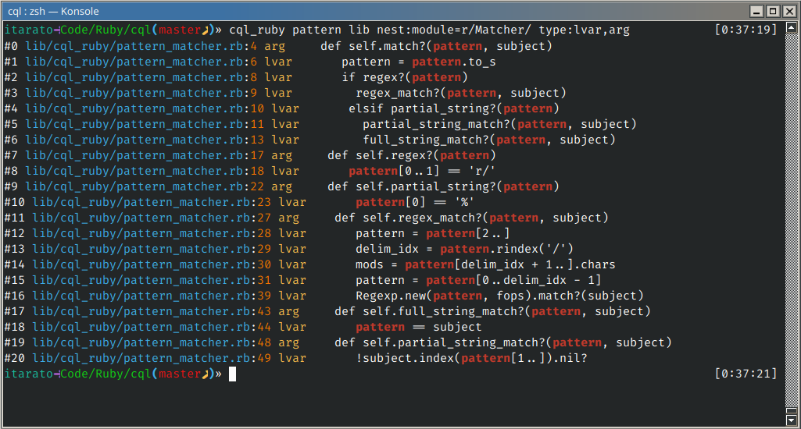

CQL
---


[](https://badge.fury.io/rb/cql_ruby)

Code Query Language is a command line semantic code search tool for Ruby. This is not a replacement to Grep as it is only looking for AST leaf tokens in the source code (no comments and concatenation of tokens). Leaf tokens are variables, arguments, constants, operators, etc.

Why? Because sometimes you just want to know where something is used or called from. Maybe you're debugging a giant legacy codebase and wonder who is using a class or where a hash key might originate from.

This is so far a concept prototype, any feedback or feature request (and of course bug reports) are welcomed.



Examples:

Find all classes that subclasses ApplicationRecord and has an initializer defined:

```bash
cql_ruby ApplicationRecord ./app type:const has:def=initializer
```

Find all occurrences of any variable ending with _user that is being assigned a new value inside a block, but not in test files:

```bash
cql_ruby r/_user$/ ./app type:lvasgn nest:block --exclude=%test.rb
```

## Install:

```bash
gem install cql_ruby
```

## Usage:

```
cql_ruby PATTERN PATH OPTIONS FILTERS
```

`cql_ruby --help` for more info.

Text matching both for the main pattern and any patterns in filters allows 3 different matching strategies:

- regex: `r/REGEX/(MODIFIER)*` where modifier is: `i`, `m`, `x`, `f`, `n`, example: `r/user_\d+/i` 
- partial string match: `%PATTERN`, example: `%user`
- perfect string match: `PATTERN`, example: `user`

## Filters:

### Type

Comma separated list of (parent node) types.

Example:

`cql_ruby foo ./ type:send,arg`

Available types: https://github.com/whitequark/parser/blob/master/lib/parser/meta.rb#L11-L34 (or use `--help`).
 
### Nesting

Under what structure the subject is nested.

Examples:

- `cql_ruby foo ./ nest:class=User`
- `cql_ruby bar ./ nest:block`

Accepted nest structures: `class`, `module`, `def`, `block`.

### Has child

Restrict to nodes that has a specific child.

Examples:

- `cql_ruby foo ./ has:def`
- `cql_ruby foo ./ has:def=r/user_(save|edit)/i`
