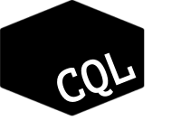

CQL
---



Code Query Language is a command line semantic code search tool for Ruby. This is not a replacement to Grep as it so

## Install:

```bash
gem install cql_ruby
```

## Usage:

```
cql PATTERN PATH
```

`cql_ruby --help` for more info.

Text matching both for the main pattern and any patterns in filters allows 3 different matching strategies:

- regex: `r/REGEX/(MODIFIER)*` where modifier is: i/m/x/f/n, example: `r/user_\d+/i` 

## Filters:

### Type

Comma separated list of (parent node) types.

Example:

`cql_ruby foo ./ type:send,arg`

Available types: https://github.com/whitequark/parser/blob/master/lib/parser/meta.rb#L11-L34
 
### Nesting

Under what structure the subject is nested.

Examples:

- `cql_ruby foo ./ nest:class=User`
- `cql_ruby bar ./ nest:block`

Accepted nest structures: class, module, def, block
